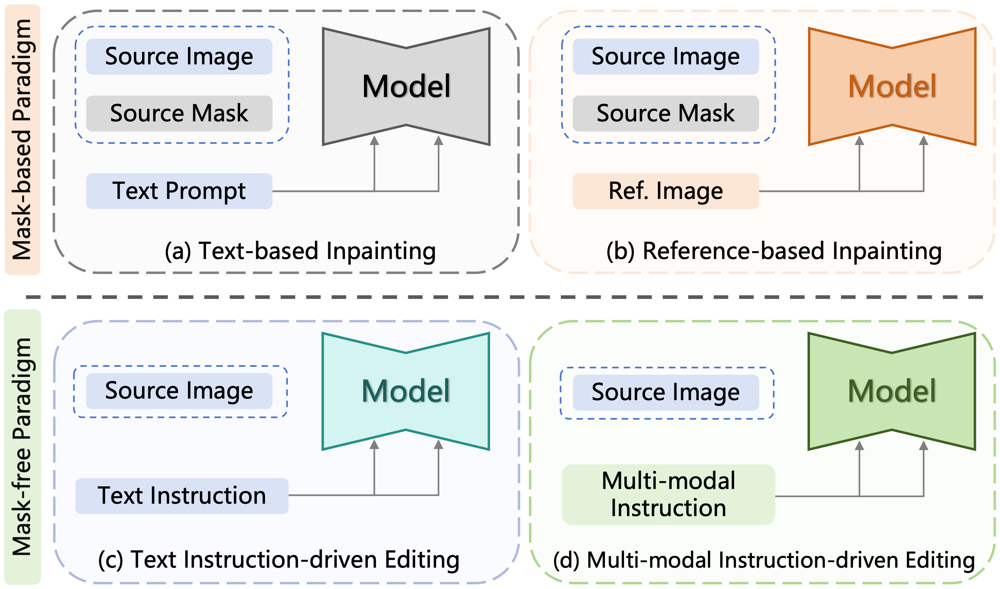
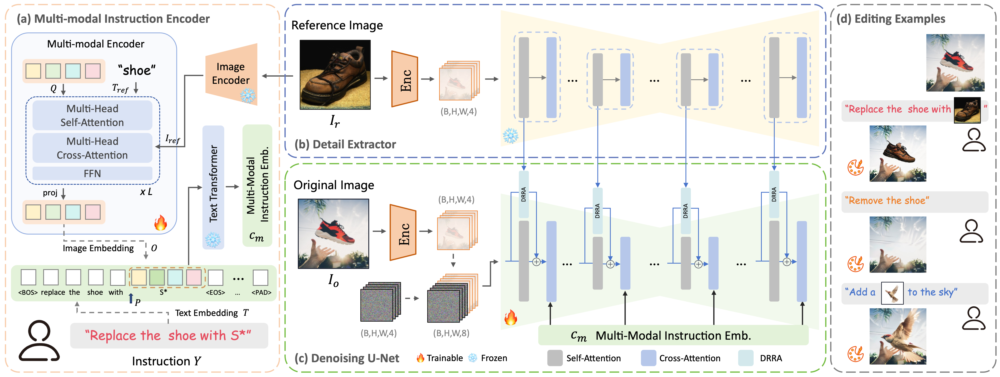

## <span>FreeEdit: Mask-free Reference-based Image Editing with Multi-modal Instruction

Pytorch implementation of [FreeEdit: Mask-free Reference-based Image Editing with Multi-modal Instruction](https://arxiv.org/abs/2409.18071)

Runze He,
Kai Ma,
Linjiang Huang,
Shaofei Huang,
Jialin Gao,
Xiaoming Wei,
Jiao Dai,
Jizhong Han,
Si Liu

[](https://arxiv.org/abs/2409.18071)
[](https://freeedit.github.io/)

<!-- <div align="center"> -->
<!--  -->
<!-- <i> Comparison between mask-based paradigm and mask-free paradigm, the former requires the user to provide the source mask to specify the editing area, while the latter conditions the diffusion model with language instructions, without the need for the masks. Reference-based inpainting conditions the model on reference image embedding, no longer supporting natural language. We use multi-modal instruction to introduce reference image features while still retaining the perception of natural language. </i> -->
<!-- </div> -->


<!-- ## Updates

- [2024/3/12] Code released.
- [2023/12/4] Paper is available [here](https://arxiv.org/abs/2312.01663). -->


## Introduction



FreeEdit consists of three components: (a) Multi-modal instruction encoder. (b) Detail extractor. (c) Denosing U-Net. Text instruction and reference image are firstly fed into the multi-modal instruction encoder to generate multi-modal instruction embedding. The reference image is additionally fed into the detail extractor to obtain fine-grained features. The original image latent is concatenated with the noise latent to introduce the original image condition. Denosing U-Net accepts the 8-channel input and interacts with the multi-modal instruction embedding through cross-attention. The DRRA modules which connect the detail extractor and the denoising U-Net, are used to integrate fine-grained features from the detail extractor to promote ID consistency with the reference image. (d) The editing examples obtained using FreeEdit.


<!-- Introducing user-specified visual concepts in image editing is highly practical as these concepts convey the user's intent more precisely than text-based descriptions. We propose FreeEdit, a novel approach for achieving such reference-based image editing, which can accurately reproduce the visual concept from the reference image based on user-friendly language instructions. Our approach leverages the multi-modal instruction encoder to encode language instructions to guide the editing process. This implicit way of locating the editing area eliminates the need for manual editing masks. To enhance the reconstruction of reference details, we introduce the Decoupled Residual ReferAttention (DRRA) module. This module is designed to integrate fine-grained reference features extracted by a detail extractor into the image editing process in a residual way without interfering with the original self-attention. Given that existing datasets are unsuitable for reference-based image editing tasks, particularly due to the difficulty in constructing image triplets that include a reference image, we curate a high-quality dataset, FreeBench, using a newly developed twice-repainting scheme. FreeBench comprises the images before and after editing, detailed editing instructions, as well as a reference image that maintains the identity of the edited object, encompassing tasks such as object addition, replacement, and deletion. By conducting phased training on FreeBench followed by quality tuning, FreeEdit achieves high-quality zero-shot editing through convenient language instructions. We conduct extensive experiments to evaluate the effectiveness of FreeEdit across multiple task types, demonstrating its superiority over existing methods. -->

## Citation

```bibtex
@misc{he2024freeedit,
      title={FreeEdit: Mask-free Reference-based Image Editing with Multi-modal Instruction}, 
      author={Runze He and Kai Ma and Linjiang Huang and Shaofei Huang and Jialin Gao and Xiaoming Wei and Jiao Dai and Jizhong Han and Si Liu},
      year={2024},
      eprint={2409.18071},
      archivePrefix={arXiv},
      primaryClass={cs.CV},
      url={https://arxiv.org/abs/2409.18071}, 
}
```

## Contact

If you have any comments or questions, feel free to contact [Runze He](https://github.com/hrz2000).